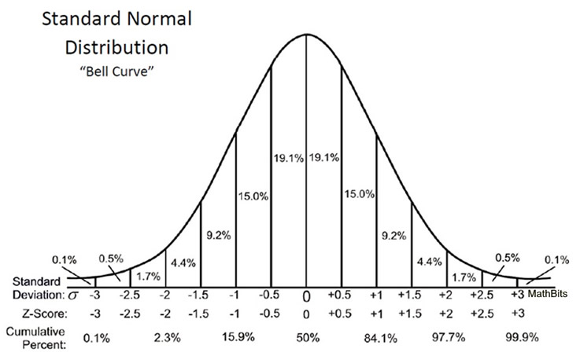

# 7.5 Model comparison

Let's restate the problem: **When we have several plausible (and hopefully un-confounded) models for the same set of observations, how should we compare the accuracy of these models?**

(7.1)

Fit to sample ($R^2$) is not good because more complex models would always be better (**overfitting**)

(7.2)

**KL divergence** is a measure of distance between probability distribution (can tell us how close a model observation probability distribution is from the true distribution /which we don't know in practice/)

This lead us to model score (**log-probability score**) of a model which doesn't require us to know the true distribution

**Log-pointwise-predictive-density (lppd)** uses the whole posterior to calculate a log-probability score (the correct Bayesian approach). lppd calculates the log-probability score for each observation (**pointwise** **log-probability** **score**). Summing those gives the **total log-probability score.** More commonly in literature the **deviance** is used which is $-2 \times lppd$. *Smaller deviance is bettter.*

**Training ([in-sample]{.underline}) deviance always improves with more complex models. Test ([out-of-sample]{.underline}) deviance doesn't.** Out-of-sample deviance is what we care about - how the model performs to unseen data, the big world. But where do we find out-of-sample?

(7.3)

**Regularizing priors** improve out-of-sample deviance but lead to worse in-sample deviance /we don't care about in-sample/. Very skeptical priors can lead to **underfitting.**

(7.4)

Two ways of evaluating models out-of-sample:

-   **cross validation (CV and PSIS)**

-   **information criteria (WAIC)**

CV is easy to straightforward, leave part of the sample out, train on the rest and evaluate on the out-fold. Repeat and average the deviance from each iteration. LOOCV is a special case where we have $N$-folds and is the best but also very computationally expensive.

PSIS is an approximation of CV score that uses observation importance to speed up things.

-   it gives feedback about its reliability - notes observations with high weights /importance/ that can make the PSIS score inaccurate.

-   can calculate standard error using the central limit theorem from the variance of the individual PSIS estimates for each observation.

AIC is the first IC we see which is bad because it assumes flat priors, Gaussian posterior, and $N >> k$. It uses lppd (in-sample deviance) and the number of parameters $p$ to estimate an out-of-sample deviance.

DIC works with informative priors but still assumes Gaussian posterior, and $N >> k$

WAIC replaces the number of parameters $p$ from AIC with a *penalty term* - sum of the variance of the log-probabilities of each observation)

A very common way of using CV/PSIS/WAIC is for **model selection**. Pick the model with the lowest criterion value and discard the others. THIS IS WRONG! This king of selection discards the information about relative model accuracy contained in the differences between the CV/PSIS/WAIC values.

Another reason to never select models based on CV/PSIS/WAIC alone is that they don't reflect the aim of causal inference. They are used to maximise predictive accuracy not to infer causation. Highly confounded models can still lead to good predictions but they won't tell us the consequence of an intervention.

So instead of model selection, we focus on **model comparison.** This helps us understand how different variables influence prediction, and in combination with a causal model, implied conditional independencies among variables help us infer causal relationships.

## 7.5.1 Model mis-selection

From the plant growth model from chapter 6:

There are three models:

-   m6.6 - just intercept

-   m6.7 - includes both treatment and fungus (post-treatment variable)

-   m6.8 - includes treatment, omits fungus

m6.8 is the one that allows us to infer causation of treatment. Once we know fungus treatment gives us no more information because treatment acts on growth through mediation via fungus (so m6.8 and not m6.7).

*(Load models from 6.5.Rmd)*

```{r}
set.seed(11)
WAIC(m6.7)
```

First value is the guess for the out-of-sample deviance, lppd, effective number of parameters - penalty, and a std error for the WAIC value.

```{r}
set.seed(77)
compare(m6.6, m6.7, m6.8, func = WAIC)
```

```{r}
compare(m6.6, m6.7, m6.8, func = PSIS)
```

Columns: WAIC, standard error (SE) of WAIC, difference of each WAIC and the best model's WAIC (m6.7 in this case), standard error of the difference (dSE), prediction penalty (pWAIC) i.e. effective number of parameters, and finally the Akaike weight.

-   **WAIC** - the lower it is, the better. Models ordered from best to worst

-   **pWAIC** - WAIC penalty, effective number of parameters. Roughly the number of dimensions of the posterior of each model. Slightly below which is to be expected by a regularized linear model.

-   **dWAIC** - difference between the WAIC values and the best model WAIC. To know if those values are small/large we need to consider also the error in the WAIC estimates. - SE and dSE

-   **SE** - the standard error of each WAIC

To compare two models we don't use **SE** but the standard error of their difference **dSE: So we use dWAIC and dSE to compare two models**

To calculate this dSE standard error of WAIC difference manually:

```{r}
set.seed(91)
waic_m6.7 <- WAIC(m6.7, pointwise = TRUE)$WAIC
waic_m6.8 <- WAIC(m6.8, pointwise = TRUE)$WAIC
n <- length(waic_m6.7)
diff_m6.7_m6.8 <- waic_m6.7 - waic_m6.8
```

```{r}
sqrt(n*var(diff_m6.7_m6.8))
```

Same as the one by compare()

The difference from the compare() table (dWAIC) is 40.9. The dSE is 10.4.

The 99% interval of the difference would be ($±2.6$ - the corresponding z-score)

{width="440"}

```{r}
40.9 + c(-1, 1) * 10.4 * 2.6
```

So yes m6.7 is significantly better. The 99% interval [13.86 - 67.94] is much bigger than 0.

```{r}
plot(compare(m6.6, m6.7, m6.8))
```

Filled points are the in-sample deviances, empty points are the estimations of the out-of-sample deviance (WAIC). Note that the out-of-sample deviance is always higher (worse) than the in-sample deviance. The black line segments show the standard error of WAIC (SE). What we really want however is the SE of the difference (dSE). That's shown with the light line segment with the triangle.

What does our analysis show so far? - That WAIC cannot be used to infer causation (m6.7 has the highest WAIC value but includes the post-treatment variable)

WAIC did it's job. It's not to infer causation but to guess predictive accuracy.

We can also see that the difference between m6.8 (the causal model) and m6.6 (the intercept model) is insignifican. But we know that m6.8 showed us that treatment works.

The difference between the WAIC of m6.6 and m6.8 is only 3 (405.9 - 402.8 = 3)

```{r}
set.seed(93)
compare(m6.6, m6.7, m6.8)@dSE
```

The standard error of the difference is 4.85 which is higher than that. So they are indistinguishable based on WAIC.

We know that the treatment does work because the posterior distribution of the treatment effect $\beta_t$ was reliably positive in m6.8. But it isn't very large. So on it's own it doesn't improve prediction of plant height.

A variable can have a causal influence on an outcome but little relative impact on it, and WAIC will tell us that.

## 7.5.2 Outliers and other illusions

In the divorce example from Chapter 5 we saw that there are a few states that are very hard for the model to retrodict. The state of Idaho in particular is an **outlier**. Points like Idaho tend to be very influential in ordinary regression models.

Let's see how PSIS and WAIC represent this importance.

```{r}

library(rethinking)
data(WaffleDivorce)
d <- WaffleDivorce
d$A <- standardize( d$MedianAgeMarriage )
d$D <- standardize( d$Divorce )
d$M <- standardize( d$Marriage )

m5.1 <- quap(
    alist(
        D ~ dnorm( mu , sigma ) ,
        mu <- a + bA * A ,
        a ~ dnorm( 0 , 0.2 ) ,
        bA ~ dnorm( 0 , 0.5 ) ,
        sigma ~ dexp( 1 )
    ) , data = d )

m5.2 <- quap(
    alist(
        D ~ dnorm( mu , sigma ) ,
        mu <- a + bM * M ,
        a ~ dnorm( 0 , 0.2 ) ,
        bM ~ dnorm( 0 , 0.5 ) ,
        sigma ~ dexp( 1 )
    ) , data = d )

m5.3 <- quap(
    alist(
        D ~ dnorm( mu , sigma ) ,
        mu <- a + bM*M + bA*A ,
        a ~ dnorm( 0 , 0.2 ) ,
        bM ~ dnorm( 0 , 0.5 ) ,
        bA ~ dnorm( 0 , 0.5 ) ,
        sigma ~ dexp( 1 )
    ) , data = d )
```

A reminder - marriage rate (M) has little effect on divorce rate (D) once we know age at marriage (A) in m5.3.

Now let's compare PSIS.

```{r}
set.seed(24071847)
compare(m5.1, m5.2, m5.3, func = PSIS)
```

m5.1 appears on top (the model that includes only A). This is because M has very little association with the outcome. So the model that omits M performs slightly better out-of-sample than the model that includes it. Even though in-sample deviance of m5.3 would be lower (better).

We also get warnings that some Pareto k values are high/very high. This means that the smoothing approximation that PSIS uses is unreliable for some points.

Let's see which states are causing the problem. We run with pointwise=TRUE as suggested by the warning. *(See figure 7.10)*

```{r}
set.seed(24071847)
PSIS_m5.3 <- PSIS(m5.3,pointwise=TRUE)
set.seed(24071847)
WAIC_m5.3 <- WAIC(m5.3,pointwise=TRUE)
plot( PSIS_m5.3$k , WAIC_m5.3$penalty , xlab="PSIS Pareto k" ,
    ylab="WAIC penalty" , col=rangi2 , lwd=2 )
```

What should we do about outliers? DON'T JUST DROP THEM!

-   If there are only a few outliers and we're reporting the results with and without them, dropping them might be okay.

-   If there are several outliers we should model them.

A problem with the Gaussian error model is that it is easily surprised because the Gaussian distribution has very thin tails. For some phenomena that's correct, like height. But others do exhibit rare, extreme observations.

One way to both use these extreme observations and reduce their influence is to use some kind of **robust regression**. A common approach is to replace the normal distribution with **Student-t distribution**. The Student-t distribution arises from a mixture of Gaussian distributions with different variances. If the variances are diverse then the tails can be quite thick.

The generalized Student-t distribution has mean $\mu$ and scale $\sigma$ parameters like the Gaussian, but also an extra parameter $\nu$ that controls the thickness of the tails.

When $\nu$ is large the tails are thin, but when it approaches 1, the tails become thicker - extreme observations are more common.

When using robust regression we don't usually try to estimate $\nu$ because there aren't enough extreme observations. Instead we assume that $\nu$ is small (thick tails) to reduce the influence of outliers.

Let's re-estimate the divorce model with a Student-t distribution with $\nu=2$.

```{r}
m5.3t <- quap(
    alist(
        D ~ dstudent( 2, mu , sigma ) ,
        mu <- a + bM*M + bA*A ,
        a ~ dnorm( 0 , 0.2 ) ,
        bM ~ dnorm( 0 , 0.5 ) ,
        bA ~ dnorm( 0 , 0.5 ) ,
        sigma ~ dexp( 1 )
    ) , data = d )
```

When we estimate PSIS now, we don't get any warnings about Pareto k values.

```{r}
PSIS(m5.3t)
```
